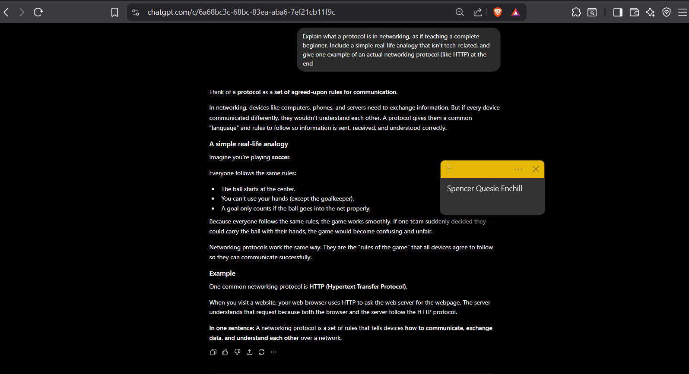
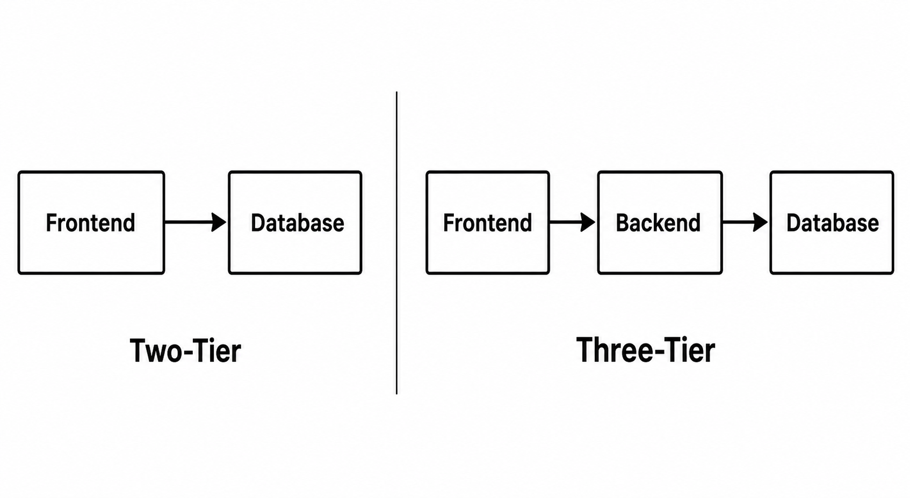
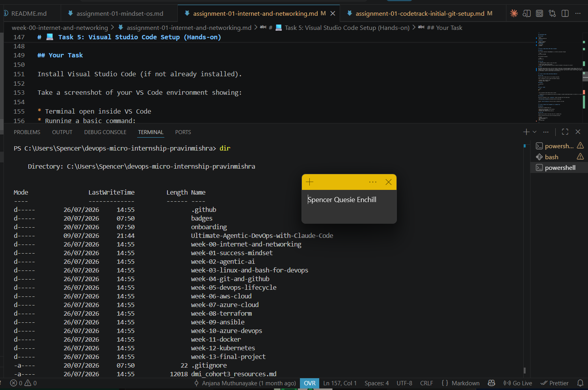

# Week 00 - Internet and Networking

Part of the DevOps Micro Internship (DMI) Cohort 3 with Agentic AI

---

# 🧑‍💻 Task 1: Using ChatGPT as Your Learning Assistant

## Scenario

You're new to DevOps and will frequently encounter technical questions. ChatGPT can be your learning companion.

## Your Task

Write a clear ChatGPT prompt to help you understand:

> "What is a protocol in networking? Explain with a simple real-life example."

Take a screenshot of your interaction showing:

* Your detailed prompt (with clear expectations)
* ChatGPT's simplified response with an example

## Screenshot

Save your screenshot in the `screenshots` folder and update the file name below.




Replace `task-1-chatgpt.png` with your actual screenshot file name.

---

## What I Learned (2–3 lines)

This task showed me how useful ChatGPT can be when I'm learning something new in DevOps. I realized that writing a clear, detailed prompt matters just as much as the question itself, since it shapes how useful the answer is. The soccer analogy made protocols click for me right away, since it's something I already understood outside of tech.

---

# 🌐 Task 2: Internet and Networking

## Scenario

Your friend is launching an online bookstore named **EpicReads**.

He asked you to explain how users globally can access his website hosted in Finland.

## Your Task

Write a short explanation (**100–150 words**) that includes:

* Packet Switching
* IP Address
* TCP/IP
* HTTP/HTTPS

💡 **Tip:** You may use ChatGPT (as demonstrated in Task 1) to refine your explanation.

## Answer
When someone visits EpicReads from anywhere in the world, their device first needs to reach the server in Finland where the website is hosted. Every device on the internet has a unique IP address, which works like a postal address so data knows where to go. The connection uses TCP/IP, where TCP makes sure data arrives complete and in order, and IP handles routing it to the right destination. Instead of sending the whole webpage at once, the data is broken into small packets that travel independently across different networks and get reassembled once they arrive. This is called packet switching, and it's what makes the internet fast and resilient. Once the connection is set up, the browser sends an HTTP (or HTTPS for encrypted, secure connections) request to ask the server for the webpage, and the server sends the content back the same way.

---

# 🏗️ Task 3: Application Architecture & Stack

## Scenario

EpicReads bookstore has two application versions:

### Two-Tier Application

* Frontend
* Database

### Three-Tier Application

* Frontend
* Backend
* Database

## Your Task

* Draw simple diagrams (hand-drawn or tool-based such as draw.io)
* Label each layer clearly
* List at least two common technologies or tools used for each layer
* Submit a screenshot or photo clearly showing your own drawing

## Diagram Screenshot / Photo

Save your diagram image in the `screenshots` folder and update the file name below.




Replace `task-3-diagram.png` with your actual diagram file name.

---

## Technologies Used

### Frontend

* React
* HTML/CSS/JavaScript

### Backend

* Node.js (Express)
* Python (Flask)
### Database

* PostgreSQL
* MongoDB

---

# 🌍 Task 4: Domain Name & DNS (Basic Concepts)

## Scenario

Your friend's bookstore **EpicReads** is currently accessible through:

```text
52.172.142.222:3000
```

He purchased the domain:

```text
epicreads.com
```

## Your Task

In **50–100 words**, explain in your own words:

1. What is DNS (Domain Name System)?
2. Which DNS record type should be used to connect the domain to the given IP, and why?

## Answer

DNS (Domain Name System) works like the internet's phone book, translating human-friendly domain names into the IP addresses computers actually use to locate servers. Instead of typing 52.172.142.222:3000 to reach EpicReads, users can simply type epicreads.com. To connect this domain to the bookstore's server, you'd use an A record, since it maps a domain name directly to an IPv4 address, which is exactly what 52.172.142.222 is.

---

# 💻 Task 5: Visual Studio Code Setup (Hands-on)

## Your Task

Install Visual Studio Code (if not already installed).

Take a screenshot of your VS Code environment showing:

* Terminal open inside VS Code
* Running a basic command:

### Windows

```powershell
dir
```

### Linux / macOS

```bash
pwd
ls
```

* Your selected VS Code theme clearly visible

⚠️ **Important:** The screenshot must show your username or another identifiable detail to confirm it is your environment.

## Screenshot

Save your screenshot in the `screenshots` folder and update the file name below.




Replace `task-5-vscode.png` with your actual screenshot file name.

---

# 🔗 Task 6: Publish Your Assignment as a LinkedIn Post

## Objective

Publishing on LinkedIn helps you:

* Build your professional online presence
* Reinforce your learning
* Document your DevOps journey publicly

## Your Task

Summarize your answers from Tasks 1–5 into a LinkedIn post.

Clearly structure your post into the following sections:

* ChatGPT
* Internet & Networking
* App Architecture
* DNS
* VS Code Setup


---

## LinkedIn Post URL

https://www.linkedin.com/posts/spencerenchill_devops-micro-internship-dmi-by-pravin-activity-7460646162405052416-9_C8?utm_source=share&utm_medium=member_desktop&rcm=ACoAAGRQq6IBvhyFikdnuZmUnAgoctctbC0h3m4


---

## LinkedIn Post Backup Copy

Paste the full text of your LinkedIn post here:

My Devops Internship journey — and here's what I learned!

I've been exploring the fundamentals of networking, web infrastructure, and development tools through a hands-on project called EpicReads — an online bookstore. Here's a breakdown of what I covered today:

ChatGPT & Prompt Engineering

I learned how to write clear, structured prompts to get better answers from AI tools. A network protocol is a set of rules that allows devices to communicate and exchange information correctly over a network — think of it like traffic rules on a road. Everyone follows the same signals so there's no chaos. Tools like HTTPS keep that communication safe and secure.

🌍 Internet & Networking

When someone visits EpicReads from anywhere in the world, their device uses an IP Address to locate the website (hosted in Finland). Data is broken into smaller pieces using Packet Switching, making transfers faster and more reliable. TCP/IP manages how that data is sent and received, while HTTP/HTTPS handles how pages load in your browser. HTPS is the secure version — especially important for logins and payments.

🏗️ App Architecture

I explored two ways to build a web app:

• 2-Tier App — The Frontend (React/HTML/CSS) talks directly to the Database (PostgreSQL/MySQL). Simple, but less secure and harder to scale.

• 3-Tier App — A Backend layer (Node.js/Django) sits between the Frontend and Database, handling business logic and security. This is the industry standard.

I also drew both diagrams by hand to solidify my understanding!

🌐 DNS (Domain Name System)

DNS is like the internet's phonebook. It converts easy-to-remember names like epicreads.com into IP addresses that computers actually use. Without it, we'd have to type long numeric addresses to visit any website. To connect epicreads.com to its IP address (52.172.142.222), an A Record is used — it links the domain name directly to an IPv4 address.

💻 VS Code Setup

I set up Visual Studio Code as my development environment, explored the terminal, and got familiar with the workspace. A small but important step in building real developer habits.

---

Every expert was once a beginner. Today was my first step. 💪

hashtag#DevOps hashtag#CloudComputing hashtag#TechJourney hashtag#DevOpsIntern 

**P.S. This post is part of the DevOps Micro Internship (DMI) with Agentic AI — Cohort 3 — by Pravin Mishra. My graded progress is public: https://lnkd.in/eDCsrUSV · Start your DevOps journey: https://lnkd.in/eTZsrS8P

---

# Reflection – Week 0

### What did you find easy?

Writing the ChatGPT prompt and understanding networking concepts like protocols and IP addresses came pretty naturally once I had a real-life analogy to connect them to. The soccer analogy for protocols especially made things click fast.

---

### What was difficult?

Figuring out which DNS record type to use for Task 4 was the trickiest part. I hadn't worked with A records, AAAA records, or CNAME before, so I needed it explained before I could confidently pick the right one.

---

### What will you improve next week?

I want to get more comfortable identifying the right networking concept on my own before asking for the answer, especially with DNS records, since that came up as a gap this week.

---

## 📌 About DMI & CloudAdvisory

DevOps Micro Internship (DMI) is a project-based DevOps program run by Pravin Mishra (The CloudAdvisory) focused on real-world execution, systems thinking, and career readiness.

It helps learners build strong DevOps foundations with hands-on experience.


## 📌 Resources

- 🌐 **DMI Official Website:** https://dmi.pravinmishra.com?utm_source=github&utm_medium=readme  
- 🎓 **University:** https://university.pravinmishra.com?utm_source=github&utm_medium=readme  
- 💬 **Discord Community:** https://discord.pravinmishra.com?utm_source=github&utm_medium=readme  
- 📝 **Blog:** https://dmi.pravinmishra.com/blog?utm_source=github&utm_medium=readme  
- ▶️ **YouTube Playlist (DMI Cohort 3):** https://www.youtube.com/playlist?list=PLFeSNDtI4Cho  
- 🔗 **Pravin Mishra (LinkedIn):** https://www.linkedin.com/in/pravin-mishra-aws-trainer/  
- 🏢 **CloudAdvisory (LinkedIn):** https://www.linkedin.com/company/thecloudadvisory/

---

*This submission is part of DevOps Micro Internship (DMI) Cohort 3 — Agentic AI Track*